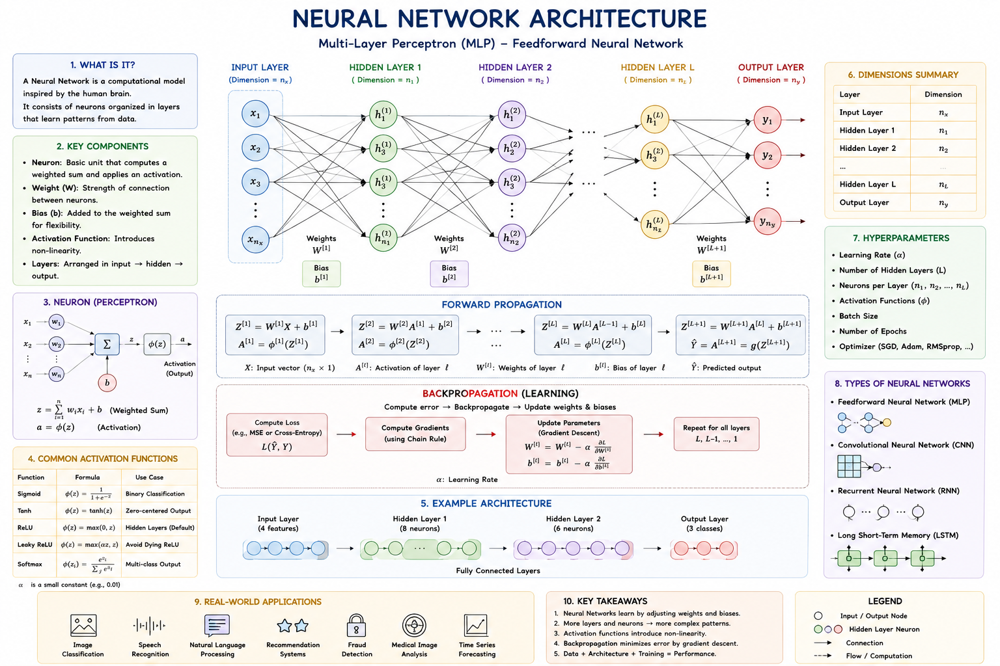

# 🧠 Day 05 — Neural Networks from Scratch

## 📝 Topic: How Machines Actually Learn


**Source:** Neural Networks from Scratch — Presentation Slides

**Scope:** Neurons → Activation Functions → Loss → Backpropagation → Gradient Descent → Training Loop → Scaling

**Date:** June 9, 2026

---

## 🎯 Learning Objectives

- Understand why rule-based systems fail and why ML learns from patterns instead.
- Define the structure of a single neuron and what each component does.
- Understand why activation functions are non-negotiable — and what happens without them.
- Know the activation function menu: Sigmoid, Tanh, ReLU, GELU, Swish.
- Define loss and understand what the model is actually minimizing during training.
- Understand backpropagation as error assignment — not just "going backwards."
- Understand gradient descent as navigating a loss landscape toward the lowest point.
- Trace the full training loop: Forward Pass → Loss → Backprop → Weight Update.
- Appreciate the scale jump from a 20-parameter XOR network to GPT-4's ~1 trillion.

---

## 🔄 Part 1 — From Rules to Patterns: A Quick Recap

### ⚙️ Why Traditional Programming Breaks Down

| Problem               | What it means                                                                 |
| --------------------- | ----------------------------------------------------------------------------- |
| **Rules don't scale** | Humans cannot write rules for every possible scenario in complex tasks        |
| **Rigid logic**       | Systems fail the moment they encounter data that doesn't fit predefined rules |

### 🤖 What Machine Learning Does Instead

> _"Pattern Discovery: Finding consistent mathematical relationships within large datasets."_

The goal isn't to code every rule. The goal is to understand the **fundamental mechanics** of how pattern discovery happens — and that's exactly what neural networks are.

---

## ❓ Part 2 — The Simplest Prediction Problem

Neural networks solve problems we handle intuitively. Consider house prices:

| Size (sq ft) | Price    |
| ------------ | -------- |
| 1,000        | $200,000 |
| 1,500        | $300,000 |
| 2,000        | $400,000 |
| **2,500**    | **?**    |

You spotted the pattern immediately: $200 per sq ft. But how do you teach a machine to find that relationship **automatically**, from data alone?

That's the core problem neural networks solve.

---

## 🔁 Part 3 — Machine Learning in One Sentence

> _"Training is a simple, iterative loop of guessing and correcting."_

```
01  Start with a guess       →  Initialize weights with random values
02  Measure error            →  How far is the guess from the truth?
03  Adjust                   →  Modify weights to be slightly less wrong
04  Repeat                   →  Do this millions of times until error is minimized
```

This loop — guess, measure, adjust, repeat — is the entire engine behind every neural network that has ever been trained.

---

## 🔬 Part 4 — The Neuron: A Tiny Decision Maker

> _"The building block of AI is a simple mathematical function, not a biological mystery."_

A neuron takes numbers in, performs basic arithmetic, and outputs a signal.

### 🏗️ The Three Components

| Component               | Role                                                                                 |
| ----------------------- | ------------------------------------------------------------------------------------ |
| **Inputs**              | Numerical data points representing features (e.g., house size, pixel intensity)      |
| **Weights & Summation** | Importance assigned to each input, combined into a single weighted sum               |
| **Activation**          | A non-linear function that decides whether the signal should "fire" or be suppressed |

### 🧮 Anatomy of a Neuron

```
output = activation(Σ wᵢxᵢ + b)
```

| Symbol          | What it means                                                   |
| --------------- | --------------------------------------------------------------- |
| **w (Weights)** | Determine the strength and importance of each input signal      |
| **x (Inputs)**  | The raw data flowing into the neuron                            |
| **b (Bias)**    | An offset that allows the neuron to shift its decision boundary |
| **activation**  | A non-linear function that decides if the signal should "fire"  |

The bias is often underestimated. Without it, the neuron's decision boundary is forced to pass through the origin — it can't shift to fit the data.

---

## ⚡ Part 5 — Why We Need Activation Functions

### ❌ The Linearity Problem

What happens if you stack layers with no activation function?

```
Layer 1: y  = W₁x + b₁
Layer 2: z  = W₂y + b₂

Combined:
z = W₂(W₁x + b₁) + b₂
z = (W₂W₁)x + (W₂b₁ + b₂)

Simplifies to:
z = W'x + b'
```

**Mathematical Collapse:** Stacking linear layers just results in another linear function. 100 layers are equivalent to just one. Depth buys you nothing.

### ✅ The Non-Linear Solution

Activation functions add **"bends"** to the math, preventing layers from collapsing into each other.

| Benefit                     | What it enables                                                                       |
| --------------------------- | ------------------------------------------------------------------------------------- |
| **Breaking Linearity**      | Prevents layers from collapsing into a single equivalent layer                        |
| **Enabling Depth**          | Allows deep networks to learn complex, multi-layered representations                  |
| **Universal Approximation** | Non-linearity allows networks to model any continuous function, no matter how complex |

---

## 🍽️ Part 6 — The Activation Function Menu

| Function         | Range   | Characteristics                 | Use Case                                    |
| ---------------- | ------- | ------------------------------- | ------------------------------------------- |
| **Sigmoid**      | 0 to 1  | Classic S-curve                 | Probability outputs                         |
| **Tanh**         | -1 to 1 | Zero-centered                   | Often converges faster than Sigmoid         |
| **ReLU**         | 0 to ∞  | `max(0, x)` — simple, efficient | The breakthrough that enabled deep networks |
| **GELU / Swish** | Smooth  | Smooth versions of ReLU         | State-of-the-art LLMs (GPT, Claude, etc.)   |

ReLU's simplicity is why it was a breakthrough — replacing a complex curve with a single threshold made deep network training fast and stable. GELU and Swish are the modern refinements: they add smoothness back in where it helps.

---

## 📉 Part 7 — The Loss Function

> _"Loss = A single number measuring how wrong we are."_

```
Lower loss = better predictions
Training goal = minimize loss
```

### 📐 Mean Squared Error (MSE)

```
L = (1/n) Σ(prediction - target)²
```

**Why squaring?**

- Makes all errors positive — you can't cancel a big overestimate with a big underestimate
- Penalizes large errors disproportionately — being off by $100,000 is much worse than being off by $1,000

**Example:**

```
Predicted:  $350,000
Actual:     $400,000
Error:      $50,000
Squared:    2,500,000,000
```

MSE is used for regression tasks. For classification, cross-entropy loss serves the same purpose.

---

## 🔙 Part 8 — Backpropagation: Assigning Blame

After a wrong prediction, the question isn't just "how wrong were we?" It's: **"which weights are responsible for this error?"**

### 🔗 The Chain of Responsibility

```
Wrong output produced
        ↓
Error signal travels BACKWARD through the network
        ↓
Each weight is adjusted proportionally to its contribution to the mistake
```

```
Input Layer → Hidden Layer → Output Layer → Loss
                                              ↓
Input Layer ← Hidden Layer ← Output Layer ← Error signal
```

Backpropagation uses the **chain rule of calculus** to compute exactly how much each weight contributed to the final error. Weights that contributed more to the mistake get adjusted more.

---

## ⛰️ Part 9 — Gradient Descent: Finding the Valley

> _"Imagine you are blindfolded on a hilly landscape. Your goal is to reach the lowest valley."_

| Element           | What it represents                                                     |
| ----------------- | ---------------------------------------------------------------------- |
| **The Landscape** | The "Loss Surface" — all possible error values the model can have      |
| **Your position** | The current weight values                                              |
| **The Valley**    | The minimum loss — the best possible model                             |
| **The Gradient**  | The slope under your feet — it tells you which direction is "downhill" |

### 📐 The Strategy

```
Feel the slope → Step downhill → Repeat → Reach the bottom
```

### ⚠️ Learning Rate: Step Size Matters

| Learning Rate  | What happens                                                   |
| -------------- | -------------------------------------------------------------- |
| **Too small**  | Takes many tiny steps — correct but extremely slow to converge |
| **Just right** | Swiftly reaches the minimum                                    |
| **Too large**  | Overshoots the valley — diverges instead of converging         |

Choosing the right learning rate is one of the most important hyperparameter decisions in training.

---

## 🔄 Part 10 — The Training Loop: Putting It All Together

```
01  Forward Pass      →  Data flows through the network → generates a prediction
        ↓
02  Calculate Loss    →  Measure the error between prediction and ground truth
        ↓
03  Backpropagate     →  Trace error backward, assign "blame" to each weight
        ↓
04  Update Weights    →  Adjust weights using gradient descent to reduce future error
        ↓
        Repeat millions of times
```

This loop is identical whether you're training a 20-parameter network or GPT-4. The scale changes. The loop doesn't.

---

## 🚀 Part 11 — Scaling to the Moon

The same four-step training loop runs at every scale:

| Model           | Parameters  | Same Loop?                            |
| --------------- | ----------- | ------------------------------------- |
| **XOR Network** | ~20         | ✅ Forward → Loss → Backprop → Update |
| **GPT-4**       | ~1 Trillion | ✅ Forward → Loss → Backprop → Update |

The gap between 20 parameters and 1 trillion is what produced reasoning, coding, and language understanding as emergent capabilities. The algorithm is the same. The scale is what changes everything.

---

## 📖 Key Terms

| Term                    | What it means                                                                                                          |
| ----------------------- | ---------------------------------------------------------------------------------------------------------------------- |
| **Neuron**              | The basic computational unit — takes inputs, applies weights and bias, outputs a signal through an activation function |
| **Weight (w)**          | A learnable parameter that determines the importance of each input                                                     |
| **Bias (b)**            | A learnable offset that shifts the neuron's decision boundary                                                          |
| **Activation Function** | A non-linear function applied to a neuron's output — prevents mathematical collapse                                    |
| **ReLU**                | Rectified Linear Unit — `max(0, x)`. The activation that enabled modern deep learning                                  |
| **GELU / Swish**        | Smooth activation functions used in state-of-the-art LLMs                                                              |
| **Loss Function**       | A single number measuring prediction error — the training objective to minimize                                        |
| **MSE**                 | Mean Squared Error — sums squared differences between predictions and targets                                          |
| **Backpropagation**     | The algorithm that traces error backward through the network to assign responsibility to each weight                   |
| **Gradient**            | The slope of the loss surface — tells the optimizer which direction reduces loss                                       |
| **Gradient Descent**    | The optimization strategy of stepping in the direction that reduces loss                                               |
| **Learning Rate**       | A hyperparameter controlling step size during gradient descent                                                         |
| **Loss Surface**        | The multi-dimensional landscape of all possible error values across all weight combinations                            |
| **Global Minimum**      | The lowest point on the loss surface — the optimal model                                                               |
| **Forward Pass**        | The computation of a prediction by passing data through the network                                                    |
| **Training Loop**       | The iterative cycle of forward pass → loss → backprop → weight update                                                  |
| **Parameter**           | Any learnable value in the model — weights and biases together                                                         |
| **Hyperparameter**      | A setting chosen before training (e.g., learning rate, number of layers) — not learned from data                       |

---

## 📂 Summary of Tasks

- [x] Understood: Why rule-based AI fails and what ML does instead.
- [x] Understood: The anatomy of a single neuron — inputs, weights, bias, activation.
- [x] Understood: Why linear layers without activation functions mathematically collapse.
- [x] Learned: The activation function menu — Sigmoid, Tanh, ReLU, GELU, Swish.
- [x] Understood: What the loss function is and how MSE penalizes large errors.
- [x] Understood: Backpropagation as blame assignment — not just "going backwards."
- [x] Understood: Gradient descent as navigating a loss landscape — and why learning rate matters.
- [x] Traced: The full training loop — Forward Pass → Loss → Backprop → Weight Update.
- [x] Appreciated: The scale gap between a 20-parameter XOR network and GPT-4's ~1 trillion parameters — same loop, different scale.

---

## 💡 My Takeaway

Two things crystallized today:

**On Activation Functions:** The linearity collapse proof is the most important thing in this session. If you stack 100 layers with no activation, you get the exact same result as 1 layer. All that depth is mathematically meaningless. Activation functions are what give neural networks their expressive power — they're not an add-on, they're the reason deep learning works at all.

**On the Training Loop:** The fact that GPT-4 and a tiny XOR network run on the exact same four-step loop is equal parts humbling and clarifying. Forward pass. Loss. Backprop. Update. The algorithm is simple. What changes is the number of parameters, the amount of data, and the compute thrown at it. Emergent capabilities aren't a different kind of intelligence — they're what happens when you run the same loop enough times at enough scale.

---

## 📈 Next Up

**Transformers & Attention** — how the attention mechanism works mathematically, multi-head attention, positional encoding, and why the Transformer architecture replaced RNNs entirely.

---

## 🔗 Resources
- [Harkirat Singh 100x bootcamp]
- [3Blue1Brown — Neural Networks series](https://www.3blue1brown.com/topics/neural-networks) — the best visual intuition for how networks learn
- [Andrej Karpathy — micrograd](https://github.com/karpathy/micrograd) — building backpropagation from scratch in ~100 lines
- [Deep Learning Book — Goodfellow et al.](https://www.deeplearningbook.org/) — the definitive reference
- [Visualizing Gradient Descent](https://www.youtube.com/watch?v=IHZwWFHWa-w) — 3Blue1Brown on optimization
- [Neural Networks from Scratch — sentdex](https://nnfs.io/) — hands-on implementation guide

---


_Follow my journey! Feel free to ⭐ this repository to stay updated._
