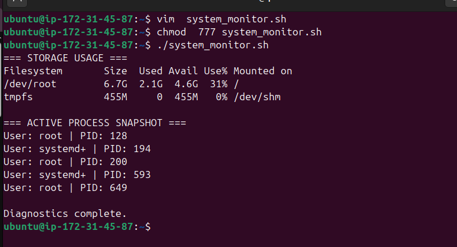

# 🚀 Shell Scripting for DevOps

## 📝 Topic: Bash Scripting — Shebang, Permissions, Pipelines, Reliability & Automation

**Instructor:** [Abhishek Veeramalla](https://github.com/iam-veeramalla)
**Date:** June 10, 2026

---

## 🎯 Learning Objectives

- Understand the Shebang line and why `/bin/bash` must be explicit.
- Master essential file and system commands used in automation scripts.
- Read and write Linux file permissions using the `chmod` numeric model.
- Build production pipelines using `|`, `grep`, and `awk`.
- Apply `set -e`, `set -x`, and `set -o pipefail` as production fail-safes.
- Write conditional logic, loops, and signal traps in bash.
- Build a real-world system diagnostics script from scratch.

---

## 🔖 1. The Shebang Line

Every bash script starts with a **Shebang** — the first line that tells the kernel which interpreter to use.

```bash
#!/bin/bash
```

> **Purpose:** Instructs the kernel's program loader to use the binary at `/bin/bash` to interpret this script.

### ⚠️ `/bin/sh` vs `/bin/bash` — A Critical Difference

| Shell       | Behaviour on Ubuntu                                                        |
| ----------- | -------------------------------------------------------------------------- |
| `/bin/sh`   | Symlinked to `/bin/dash` on modern Ubuntu — faster but lacks bash features |
| `/bin/bash` | Full-featured Bash — supports all "bashisms"                               |

**The trap:** Legacy systems linked `/bin/sh` → `/bin/bash`. Modern Ubuntu links `/bin/sh` → `/bin/dash`. A script with bash-only syntax (arrays, `[[`, `((...))`) will **silently fail or crash** if the Shebang says `#!/bin/sh`.

> ✅ **Best Practice:** Always write `#!/bin/bash` explicitly if your script uses any bash-specific syntax.

---

## 🛠️ 2. Essential File & System Commands

| Command                 | What it does                                                                                                  |
| ----------------------- | ------------------------------------------------------------------------------------------------------------- |
| `touch <filename>`      | Creates an empty file. Essential for non-interactive automation where editors can't be opened.                |
| `vim` / `vi`            | Terminal text editors. `vi` is universally pre-installed. `vim` adds syntax highlighting.                     |
| `cat <file>`            | Prints file contents to stdout without modification.                                                          |
| `ls -ltr`               | Lists directory contents — long format (`l`), sorted by time (`t`), reversed (`r`) — newest at bottom.        |
| `find <path> <options>` | Recursively searches for files and directories matching given criteria — name, type, size, time, permissions. |
| `man <command>`         | Opens the system manual for any command. The definitive reference.                                            |
| `pwd`                   | Prints the absolute path of the current working directory.                                                    |
| `mkdir <name>`          | Creates a new directory.                                                                                      |
| `rm -rf <path>`         | Recursively and forcefully removes files or directories. ⚠️ Irreversible under root.                          |

### 📝 vim Survival Keys

```
Esc + i        → Enter Insert Mode (start typing)
Esc + :wq!     → Save and Quit
Esc + :q!      → Force Quit without saving
```

### 🔍 `find` — Recursive File Search

The `find` command searches the filesystem recursively from a given starting path. One of the most used commands in DevOps automation — locating log files, stale configs, scripts missing execute permission, and more.

**Basic syntax:**

```bash
find <starting_path> <options> <criteria>
```

**Find by name:**

```bash
find . -name "*.sh"               # all shell scripts in current directory
find /var/log -name "*.log"       # all log files under /var/log
find / -name "system_monitor.sh"  # search the entire filesystem
```

**Find by type:**

```bash
find . -type f    # files only
find . -type d    # directories only
find . -type l    # symbolic links only
```

**Find by size:**

```bash
find /var/log -size +100M    # files larger than 100 MB
find /tmp -size -1k          # files smaller than 1 KB
```

**Find by modification time:**

```bash
find . -mtime -1    # modified in the last 24 hours
find . -mtime +7    # modified more than 7 days ago
```

**Find by permissions:**

```bash
find . -perm 777           # files with full open permissions (security risk)
find . -perm /u+x          # files the owner can execute
```

**Find and execute a command on results:**

```bash
# Delete all .tmp files older than 7 days — classic cron job pattern
find /tmp -name "*.tmp" -mtime +7 -exec rm -f {} \;

# Set execute permission on all .sh files found
find . -name "*.sh" -exec chmod +x {} \;
```

**Pipeline with find:**

```bash
# Find all logs and grep for errors in one shot
find /var/log -name "*.log" | xargs grep "ERROR"
```

**DevOps use cases:**

| Task                                  | Command                                 |
| ------------------------------------- | --------------------------------------- |
| Find all scripts missing execute bit  | `find . -name "*.sh" ! -perm /u+x`      |
| Locate large files eating disk space  | `find / -size +500M -type f`            |
| Clean up old temp files automatically | `find /tmp -mtime +3 -exec rm -f {} \;` |
| Audit world-writable files (security) | `find / -perm -o+w -type f`             |
| Find recently changed config files    | `find /etc -mtime -1 -type f`           |

---

## 🔐 3. Linux File Permissions

Linux enforces a strict permission model — users only interact with files they are authorized to touch.

### 🔢 The `chmod` Numeric Model

```bash
chmod 755 script.sh
```

```
  7       5       5
[Owner] [Group] [Others]
```

Permissions are calculated using a **3-bit binary value**:

| Value | Binary | Permission    |
| ----- | ------ | ------------- |
| `4`   | 100    | Read (`r`)    |
| `2`   | 010    | Write (`w`)   |
| `1`   | 001    | Execute (`x`) |

Combine them to get:

| Number      | Permissions | Meaning          |
| ----------- | ----------- | ---------------- |
| `7` (4+2+1) | `rwx`       | Full access      |
| `6` (4+2)   | `rw-`       | Read and Write   |
| `5` (4+1)   | `r-x`       | Read and Execute |
| `4`         | `r--`       | Read only        |
| `0`         | `---`       | No access        |

### 👥 The Three Permission Categories

| Category         | Who it applies to                         |
| ---------------- | ----------------------------------------- |
| **Owner / User** | The account that created the file         |
| **Group**        | A defined cluster of users sharing access |
| **Others**       | Everyone else authenticated on the system |

### 🧪 Common Permission Examples

```bash
chmod 755 script.sh   # Owner: full | Group: read+exec | Others: read+exec
chmod 644 config.txt  # Owner: read+write | Group: read | Others: read
chmod 400 key.pem     # Owner: read only | Group: none | Others: none  ← for SSH keys
chmod 700 secret.sh   # Owner: full | Group: none | Others: none
```

---

## 🔀 4. Pipelines, `grep`, and `awk`

### 🔗 The Pipe Operator `|`

The pipe intercepts the **stdout** of the left command and feeds it as **stdin** to the right command.

```
Command A  →  stdout  →  [pipe]  →  stdin  →  Command B
```

```bash
ps -ef | grep "nginx"
# ps -ef produces all processes → grep filters for "nginx"
```

### 🔍 `grep` — Pattern Matching

Scans text line-by-line and outputs only lines matching the pattern.

```bash
grep "ERROR" app.log          # find all error lines
grep -i "warning" app.log     # case-insensitive
grep -v "INFO" app.log        # exclude INFO lines
grep -n "FATAL" app.log       # show line numbers
```

### 📊 `awk` — Column Extraction

A pattern-scanning tool that treats whitespace as a delimiter and lets you extract specific columns.

```bash
# $1 = first column, $2 = second column, etc.
ps -ef | awk '{print $1}'   # print all usernames
ps -ef | awk '{print $2}'   # print all PIDs
```

### ✅ Production Pipeline Example

```bash
# Extract PIDs of all running amazon processes
ps -ef | grep "amazon" | awk '{print $2}'
```

### ⚠️ The Classic Pipe Interview Trap

**Question:** Why does this fail?

```bash
date | echo "Today is"
```

**Answer:** `echo` ignores stdin entirely — it only outputs arguments passed on the command line. The pipe has nothing to attach to.

**Fix — use command substitution:**

```bash
echo "Today is $(date)"
```

---

## 🛡️ 5. Script Reliability — Fail-Safe Flags

By default, bash **keeps running even when a command fails**. In production, this causes silent cascading failures.

Declare these three flags right after the Shebang:

```bash
#!/bin/bash
set -x          # Debug: print each command before executing it
set -e          # Exit immediately if any command returns non-zero
set -o pipefail # Fail if ANY command in a pipeline fails — not just the last one
```

### 🔍 What Each Flag Does

| Flag              | Behaviour                                                                        |
| ----------------- | -------------------------------------------------------------------------------- |
| `set -x`          | Prints each command to the terminal before running it — invaluable for debugging |
| `set -e`          | Exits the script the moment any command fails (non-zero exit code)               |
| `set -o pipefail` | Marks a pipeline as failed if **any** command in it fails                        |

### ⚠️ The `set -e` Pitfall Without `pipefail`

```bash
set -e
bad_command | echo "Hi"   # bad_command fails — but echo succeeds
                           # bash sees exit code 0 from echo → script continues!
```

With `set -o pipefail`:

```bash
set -e
set -o pipefail
bad_command | echo "Hi"   # now the whole pipeline fails → script exits ✅
```

> **Rule:** Never use `set -e` alone in a production script. Always pair it with `set -o pipefail`.

---

## 🔁 6. Conditional Logic, Loops & Signal Trapping

### 🌿 if-else

```bash
if [ $A -gt $B ]; then
    echo "A is greater than B"
else
    echo "B is greater than A"
fi
```

> **Note:** Bash conditionals close with `fi` — `if` spelled backwards.

### 🔢 Common Comparison Operators

| Operator | Meaning               |
| -------- | --------------------- |
| `-gt`    | Greater than          |
| `-lt`    | Less than             |
| `-eq`    | Equal to              |
| `-ne`    | Not equal to          |
| `-ge`    | Greater than or equal |
| `-le`    | Less than or equal    |

### 🔄 for Loop

```bash
for i in {1..10}; do
    echo "Iteration: $i"
done
```

### 🚨 Signal Trapping with `trap`

When a user presses `Ctrl + C`, the OS sends a `SIGINT` signal that kills the script — potentially leaving temp files, locked databases, or broken states behind.

`trap` intercepts that signal and runs a cleanup handler first:

```bash
trap "rm -rf /tmp/staging_db_lock; echo 'Cleanup complete. Exiting.'" SIGINT
```

**How it works:**

```
User presses Ctrl+C
        ↓
OS sends SIGINT to script
        ↓
trap catches it → runs cleanup handler
        ↓
Script exits cleanly
```

> **Real-world use case:** A deployment script that locks a database during migration. If interrupted mid-flight, `trap` ensures the lock file is removed and the DB isn't left in a broken state.

---

## ☁️ 7. Real-World DevOps Use Cases

### 📊 Node Health Monitoring

DevOps engineers maintain hundreds of compute hosts. Scripts extract resource state automatically:

```bash
df -h           # disk usage across all mounted partitions
free -g         # RAM usage in gigabytes
nproc           # number of available CPU cores
top             # live process monitor (interactive)
ps -ef          # all running processes snapshot
```

### 🌐 Remote Log Analysis

```bash
# Stream a remote log file and filter for errors in real time
curl https://logs.example.com/app.log | grep "ERROR"

# Download a log file to disk for persistent analysis
wget https://logs.example.com/app.log -O app.log
```

---

## 🧪 8. Lab: System Diagnostics Script

### 🎯 Task

- Create `system_monitor.sh`
- Permissions: Owner = `rwx`, Group = `r--`, Others = `r--` → `chmod 744`
- Include reliability flags
- Extract PIDs of active system services
- Set up a `trap` for clean exit

### 💻 Implementation

```bash
#!/bin/bash
# ==========================================
# Author: Mitesh
# Date: 2026-06-10
# Purpose: Core Diagnostics Lab Demo
# Version: V1.0
# ==========================================

set -e
set -o pipefail

trap "echo -e '\nAborted by user. Cleaning up...'; exit 1" SIGINT

echo "=== STORAGE USAGE ==="
df -h | head -n 3

echo -e "\n=== ACTIVE PROCESS SNAPSHOT ==="
ps -ef | grep -E "ssh|systemd" | awk '{print "User: " $1 " | PID: " $2}' | head -n 5

echo -e "\nDiagnostics complete."
```

### ▶️ How to Run

```bash
touch system_monitor.sh    # create the file
vim system_monitor.sh      # paste the script above
chmod 744 system_monitor.sh   # set permissions
./system_monitor.sh        # execute
```

### 📋 Expected Output

```
=== STORAGE USAGE ===
Filesystem      Size  Used Avail Use% Mounted on
/dev/root        29G  5.2G   24G  18% /
tmpfs           483M     0  483M   0% /dev/shm

=== ACTIVE PROCESS SNAPSHOT ===
User: root       | PID: 1
User: root       | PID: 523
User: ubuntu     | PID: 1042
...

Diagnostics complete.
```

### My output of the above script

## 

## 📖 Key Terms

| Term                  | What it means                                                                        |
| --------------------- | ------------------------------------------------------------------------------------ |
| **Shebang**           | `#!/bin/bash` — the first line that tells the kernel which interpreter to use        |
| **dash**              | Lightweight shell Ubuntu links to `/bin/sh` — faster but lacks bash features         |
| **bashisms**          | Bash-specific syntax that won't work in `sh` or `dash`                               |
| **chmod**             | Change Mode — updates file permissions                                               |
| **stdout**            | Standard Output — the default output stream of a command                             |
| **stdin**             | Standard Input — the default input stream a command reads from                       |
| **pipe (`\|`)**       | Connects stdout of one command to stdin of the next                                  |
| **grep**              | Filters lines of text matching a pattern                                             |
| **awk**               | Column-based text processor — extracts fields from structured output                 |
| **`set -e`**          | Exit immediately on any non-zero command return                                      |
| **`set -x`**          | Print each command before executing — debug mode                                     |
| **`set -o pipefail`** | Fail the script if any command in a pipeline fails                                   |
| **SIGINT**            | Signal Interrupt — sent by `Ctrl+C` to terminate a process                           |
| **`trap`**            | Intercepts OS signals and runs a custom handler before exiting                       |
| **Exit code**         | Integer returned by a command: `0` = success, non-zero = failure                     |
| **`find`**            | Recursively searches for files/directories by name, type, size, time, or permissions |
| **`-exec`**           | `find` flag that runs a command on every matched result                              |
| **`xargs`**           | Converts stdin into arguments — used to pass `find` output to other commands         |
| **`df -h`**           | Disk Free — shows storage usage in human-readable format                             |
| **`free -g`**         | Shows RAM usage in gigabytes                                                         |
| **`nproc`**           | Prints the number of available CPU cores                                             |
| **`ps -ef`**          | Snapshot of all currently running processes                                          |
| **`curl`**            | Streams remote URLs to stdout — perfect for pipeline processing                      |
| **`wget`**            | Downloads a remote file to local disk                                                |

---

## 📂 Summary of Tasks

- [x] Understood: The Shebang line and why `/bin/dash` breaks bash scripts on Ubuntu.
- [x] Learned: Core file and system commands — `touch`, `cat`, `ls -ltr`, `rm -rf`, `man`.
- [x] Understood: The `chmod` numeric model — `4=r`, `2=w`, `1=x` and how to combine them.
- [x] Built: A 3-command pipeline using `ps -ef | grep | awk` to extract PIDs.
- [x] Understood: The `set -e` + `set -o pipefail` pair and why both are required.
- [x] Written: An `if-else` conditional and a `for` loop in bash.
- [x] Implemented: A `trap` handler to catch `SIGINT` and clean up before exit.
- [x] Built: `system_monitor.sh` — a production-style diagnostics script from scratch.

---

## 💡 My Takeaway

The most important concept today was the `set -e` + `set -o pipefail` combination. Before this, I assumed bash would stop if something broke. It doesn't. It keeps going. A deployment script that silently continues past a failed database migration and marks itself as successful is worse than one that crashes loudly — because you won't know anything is wrong until production is broken.

The `trap` concept also reframed how I think about script design. It's not enough to write code that works when everything goes right. In a real DevOps environment, scripts get interrupted — by users, by OOM killers, by network drops. `trap` is what separates scripts that leave systems in a clean state from ones that leave locked files and broken transactions behind.

---

## 📈 Next Up

**Day 09:** Advanced Shell Scripting — functions, arrays, string manipulation, and building a full automated deployment script.

---

## 🔗 Resources

- [Bash Manual — gnu.org](https://www.gnu.org/software/bash/manual/bash.html)
- [ShellCheck — Bash linter](https://www.shellcheck.net/)
- [Explain Shell — command breakdown](https://explainshell.com/)
- [chmod Calculator](https://chmod-calculator.com/)
- [The Art of Command Line](https://github.com/jlevy/the-art-of-command-line)

---

_Follow my journey! Feel free to ⭐ this repository to stay updated._
