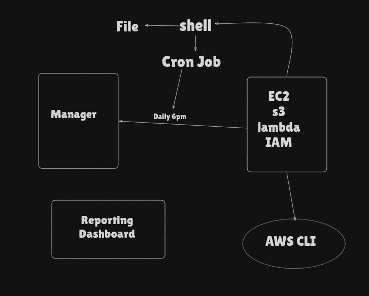

# 🚀 Day 09 — AWS Resource Tracker + Git & GitHub Fundamentals

## 📝 Topic: Shell Scripting for Cloud Cost Optimization + Version Control with Git

**Instructor:** [Abhishek Veeramalla](https://github.com/iam-veeramalla)
**Date:** June 11, 2026

---

## 🎯 Learning Objectives

- Understand why DevOps engineers are responsible for cloud cost optimization.
- Build an AWS Resource Tracker script that lists S3, EC2, Lambda, and IAM resources.
- Use `jq` to parse JSON output from the AWS CLI into clean, readable data.
- Schedule the script to run automatically using a Cron job.
- Understand what a Version Control System (VCS) is and the two problems it solves.
- Distinguish between centralized and distributed VCS — and why Git won.
- Clarify the difference between Git (the tool) and GitHub (the platform).
- Execute the complete Git lifecycle: `init` → `status` → `add` → `commit` → `log` → `reset`.

---

## ☁️ Part 1 — The Problem: Cloud Cost Sprawl

### 💸 Why Cloud Costs Get Out of Control

Organizations move to the cloud for one key reason: **pay only for what you use**. But in practice, teams spin up resources and forget about them.

Common culprits:

| Resource             | How it goes idle                                      |
| -------------------- | ----------------------------------------------------- |
| **EC2 instances**    | Spun up for testing, never terminated                 |
| **EBS volumes**      | Left behind after an instance is deleted              |
| **S3 buckets**       | Old data buckets with no active readers               |
| **Lambda functions** | Deprecated functions still sitting in the account     |
| **IAM users**        | Former employees or service accounts never cleaned up |

> **The DevOps responsibility:** Identify unused or redundant resources before they appear on the monthly bill as silent waste.

### 🛠️ The Solution: An Automated Resource Tracker

Instead of manually checking the AWS Console every week, build a **bash script** that:

- Lists all active resources across key AWS services
- Runs automatically on a schedule via Cron
- Produces a clean report the team can audit

---

## 📝 Part 2 — AWS Resource Tracker Script

### Question:

Write a script which will track all the AWS resources running and automated it using cron job which gets triggered at 6pm daily

---

### Workflow :



---

### 🏗️ Script Structure & Best Practices

Every production script starts with a proper header block:

```bash
#!/bin/bash

###############################################
# Author: Mitesh
# Date: 11-06-2026
# Version: v1
#
# Purpose: Reports AWS resource usage across
#          S3, EC2, Lambda, and IAM to help
#          identify cost optimization targets.
###############################################

set -x   # Debug mode: print each command before executing
```

> **Why the header matters:** When a script runs in production at 2am and something breaks, the author, date, and purpose tell the on-call engineer exactly what they're looking at without reading every line.

---

### 📋 The Full Resource Tracker

## 

### 🔍 Understanding `jq` — JSON Parser

Without `jq`, the AWS CLI returns large raw JSON blobs that are hard to read:

```json
# Without jq — raw EC2 output
{
    "Reservations": [
        {
            "Instances": [
                {
                    "InstanceId": "i-0abc123def456",
                    "InstanceType": "t2.micro",
                    "State": { "Name": "running" },
                    "PublicIpAddress": "54.210.x.x",
                    ... 40 more fields
                }
            ]
        }
    ]
}
```

With `jq` — clean extracted output:

```bash
# Extract only Instance IDs
aws ec2 describe-instances | jq '.Reservations[].Instances[].InstanceId'

# Output:
"i-0abc123def456"
"i-0xyz789ghi012"
```

**`jq` is to JSON what `grep` and `awk` are to plain text** — a dedicated filtering and parsing tool.

### 📊 Common `jq` Patterns for AWS

```bash
# Extract a specific field
jq '.FieldName'

# Extract from nested arrays
jq '.Reservations[].Instances[].InstanceId'

# Extract multiple fields
jq '.[] | {id: .InstanceId, state: .State.Name}'

# Count results
jq '. | length'

# Filter where a condition is true
jq '.[] | select(.State.Name == "running")'
```

---

### ⏰ Part 3 — Automating with Cron

Running the script manually every week defeats the purpose. A **Cron job** schedules it to run automatically.

**Open the cron editor:**

```bash
crontab -e
```

**Cron syntax:**

```
MIN  HOUR  DAY  MONTH  WEEKDAY  COMMAND
 *    *     *    *       *       /path/to/script.sh
```

**Examples:**

```bash
# Run every day at 6:00 AM
0 6 * * * /home/ubuntu/aws_resource_tracker.sh >> /var/log/aws_tracker.log 2>&1

# Run every Monday at 9:00 AM
0 9 * * 1 /home/ubuntu/aws_resource_tracker.sh >> /var/log/aws_tracker.log 2>&1

# Run on the 1st of every month at midnight
0 0 1 * * /home/ubuntu/aws_resource_tracker.sh >> /var/log/aws_tracker.log 2>&1
```

> **The `>> /var/log/aws_tracker.log 2>&1` part:** Appends both stdout and stderr to a log file so you have a record of every run — critical for debugging when something silently fails at 6am.

**Cron field quick reference:**

| Field        | Values                 |
| ------------ | ---------------------- |
| Minute       | 0–59                   |
| Hour         | 0–23                   |
| Day of Month | 1–31                   |
| Month        | 1–12                   |
| Day of Week  | 0–7 (0 and 7 = Sunday) |
| `*`          | Every value            |

---

**Cron Job Example:**


## 🗂️ Part 4 — Version Control Systems (VCS)

### ❓ What Problem Does VCS Solve?

Every team writing code faces two fundamental problems:

**Problem 1: Sharing Code**

```
Without VCS:
  Dev A emails "app_v3_final.zip" to Dev B
  Dev B edits it and emails "app_v3_final_EDITED.zip" back
  Dev C made changes to a different copy
  Nobody knows which version is current ← chaos
```

**Problem 2: Tracking Changes (Versioning)**

```
Without VCS:
  New feature deployed → breaks production
  No way to know what changed or go back
  Only option: manually undo changes from memory ← dangerous
```

> **VCS solves both:** A shared history of every change, who made it, when, and why — with the ability to travel back to any point in time.

---

### 🔀 Centralized vs. Distributed VCS

| Feature                     | Centralized (SVN, CVS)                   | Distributed (Git)                             |
| --------------------------- | ---------------------------------------- | --------------------------------------------- |
| **Where code lives**        | One central server                       | Every developer has a full copy               |
| **Single point of failure** | ✅ Yes — server goes down, work stops    | ❌ No — anyone's copy can restore the project |
| **Offline work**            | ❌ Not possible                          | ✅ Full history available locally             |
| **Speed**                   | Slower — every operation hits the server | Faster — most operations are local            |
| **Branching**               | Slow and painful                         | Fast and cheap                                |

> **Why Git won:** The 2005 Linux kernel project needed a system that could handle thousands of contributors worldwide, work offline, and never have a single point of failure. Linus Torvalds built Git in two weeks to solve this. The rest is history.

---

### 🐙 Git vs. GitHub — Not the Same Thing

A confusion that trips up beginners constantly:

|                   | Git                                              | GitHub                                                        |
| ----------------- | ------------------------------------------------ | ------------------------------------------------------------- |
| **What it is**    | Open-source version control software             | A web service built on top of Git                             |
| **Where it runs** | Installed locally on your machine                | Lives on GitHub's servers (cloud)                             |
| **What it does**  | Tracks changes, manages branches, handles merges | Hosts repositories, enables collaboration, PRs, Issues, CI/CD |
| **Alternatives**  | —                                                | GitLab, Bitbucket, Azure DevOps                               |
| **Analogy**       | The engine                                       | The car around the engine                                     |

> **One line:** Git is the tool. GitHub is where you store and share the results of using that tool.

---

## ⚡ Part 5 — The Git Lifecycle

### 🔄 The Core Workflow

```
Working Directory  →  Staging Area  →  Local Repository  →  Remote (GitHub)
     (edit)              (add)             (commit)              (push)
```

### 📋 Step-by-Step Commands

#### Step 1: Initialize a Repository

```bash
git init

# Creates a hidden .git folder that tracks everything
# ls -la → you'll see .git/ appear
```

#### Step 2: Check Status

```bash
git status

# Shows:
# - Untracked files (new files Git doesn't know about)
# - Modified files (changed since last commit)
# - Staged files (ready to commit)
```

#### Step 3: Stage Files

```bash
git add filename.sh      # stage a specific file
git add .               # stage ALL changes in current directory
```

> **Why staging exists:** It lets you group related changes into one commit, even if you modified many files. You decide what goes into each "save point".

#### Step 4: Commit

```bash
git commit -m "Add AWS resource tracker script"

# Creates a permanent snapshot with:
# - A unique hash (e.g. a3f8c21)
# - Author name and email
# - Timestamp
# - Your message
```

**Good vs bad commit messages:**

```bash
# ❌ Bad
git commit -m "fix"
git commit -m "changes"
git commit -m "update script"

# ✅ Good
git commit -m "Add jq parsing to EC2 instance ID extraction"
git commit -m "Fix cron schedule — change from daily to weekly"
git commit -m "Add IAM user listing to resource tracker"
```

#### Step 5: View History

```bash
git log               # full commit history with hashes, author, date, message
git log --oneline     # compact view — one line per commit

# Output:
# a3f8c21 Add IAM user listing to resource tracker
# 7b2e104 Fix cron schedule — change from daily to weekly
# 9d1a033 Add AWS resource tracker script
```

#### Step 6: Revert to a Previous State

```bash
# Revert to a specific commit — DESTRUCTIVE, can't undo
git reset --hard a3f8c21

# Safer: create a new commit that undoes a previous one
git revert a3f8c21
```

> ⚠️ **`git reset --hard` is permanent.** Use `git revert` in production — it undoes changes by creating a new commit, preserving the full history.

---

### 🔄 The Full Git Workflow (Visual)

```
1. Edit file
       ↓
2. git status          ← see what changed
       ↓
3. git add .           ← stage the changes
       ↓
4. git commit -m ""    ← save the snapshot
       ↓
5. git log             ← verify it's recorded
       ↓
6. git push            ← send to GitHub (next session)
```

---

### 🌐 Creating a GitHub Repository

```
1. github.com → Sign in → New Repository
2. Repository name: devops-learning-journal
3. Description: "My 45-day DevOps learning journey"
4. Visibility: Public (for portfolio) or Private
5. ✅ Add README.md
6. Create repository

# Connect local repo to GitHub:
git remote add origin https://github.com/yourusername/devops-learning-journal.git
git push -u origin main
```

---

## 📖 Key Terms

| Term                   | What it means                                                                      |
| ---------------------- | ---------------------------------------------------------------------------------- |
| **AWS CLI**            | Command Line Interface for AWS — controls all AWS services from the terminal       |
| **`jq`**               | A lightweight command-line JSON parser — extracts specific fields from JSON output |
| **Cron**               | A Linux time-based job scheduler — runs commands automatically on a schedule       |
| **`crontab`**          | The file that stores cron job definitions for a user                               |
| **VCS**                | Version Control System — tracks changes to files over time                         |
| **Versioning**         | The ability to save and restore previous states of a project                       |
| **Centralized VCS**    | Single server holds all history — SVN, CVS — single point of failure               |
| **Distributed VCS**    | Every developer has a full copy of the repository — Git                            |
| **Git**                | Open-source distributed version control software — runs locally                    |
| **GitHub**             | A cloud platform for hosting, sharing, and collaborating on Git repositories       |
| **Repository (repo)**  | A directory tracked by Git — contains all files and their full history             |
| **`.git` folder**      | The hidden directory Git creates inside a repo to store all tracking data          |
| **Working Directory**  | The local folder where you edit files                                              |
| **Staging Area**       | A holding zone for changes you've selected to include in the next commit           |
| **Commit**             | A permanent snapshot of the staged changes — has a unique hash                     |
| **`git init`**         | Initializes a new Git repository in the current directory                          |
| **`git status`**       | Shows the current state — untracked, modified, and staged files                    |
| **`git add`**          | Moves changes from the working directory to the staging area                       |
| **`git commit`**       | Saves staged changes as a new commit in the local repository                       |
| **`git log`**          | Displays the full commit history                                                   |
| **`git reset --hard`** | Reverts the repository to a previous commit — destructive, permanent               |
| **`git revert`**       | Creates a new commit that undoes a previous one — safe, preserves history          |
| **Remote**             | A version of the repository hosted on GitHub or another server                     |
| **`git push`**         | Sends local commits to the remote repository                                       |

---

## 📂 Summary of Tasks

- ✅ Understood: Why cloud cost optimization is a core DevOps responsibility.
- ✅ Built: AWS Resource Tracker script listing S3, EC2, Lambda, and IAM resources.
- ✅ Learned: `jq` — parsing JSON output from the AWS CLI to extract specific fields.
- ✅ Understood: Cron job syntax and scheduled the tracker to run automatically with log output.
- ✅ Understood: The two problems VCS solves — sharing code and tracking changes.
- ✅ Understood: Centralized vs. distributed VCS — why Git's model is superior.
- ✅ Clarified: Git (local tool) vs. GitHub (cloud platform) — not the same thing.
- ✅ Practiced: The full Git lifecycle — `init` → `status` → `add` → `commit` → `log` → `reset`.
- ✅ Created: A GitHub repository to host the learning journal.

---

## 💡 My Takeaway

Two things connected today that seemed unrelated at first:

**On the AWS Tracker:** The script itself is simple — a few AWS CLI commands and some `jq` parsing. The real value is the Cron job. A report that runs once manually is a task. A report that runs every Monday at 9am and writes to a log file is a **system**. That's the DevOps mindset: turn manual work into automated, auditable processes.

**On Git:** The staging area confused me until the purpose clicked. Git doesn't assume all your changes belong together. You might edit 5 files but only want to commit 3 of them as one logical change. `git add` is where you make that decision. The commit is the record. The staging area is the filter between the two.

The `git reset --hard` vs `git revert` distinction is also worth remembering — one rewrites history (dangerous in shared repos), the other adds to it (safe everywhere).

---

## 📈 Next Up

**Day 8:** GitHub Deep Dive — Pull Requests, Branching strategies, Issues, Forks, and integrating GitHub with CI/CD pipelines.

---

## 🔗 Resources

- [Abhishek Veermalla Date Playlist](https://youtube.com/playlist?list=PLdpzxOOAlwvIc1TjTwopNSjRJkzES2ZXk&si=kx2Ia6UsQ1Oou6Vg)
- [AWS CLI EC2 Reference](https://docs.aws.amazon.com/cli/latest/reference/ec2/)
- [AWS CLI IAM Reference](https://docs.aws.amazon.com/cli/latest/reference/iam/)
- [jq Manual](https://stedolan.github.io/jq/manual/)
- [Crontab Guru — Cron expression editor](https://crontab.guru/)
- [Pro Git Book — Free](https://git-scm.com/book/en/v2)
- [GitHub Docs — Getting Started](https://docs.github.com/en/get-started)
- [Git Cheat Sheet — GitHub](https://education.github.com/git-cheat-sheet-education.pdf)

---

_Follow my journey! Feel free to ⭐ this repository to stay updated._
