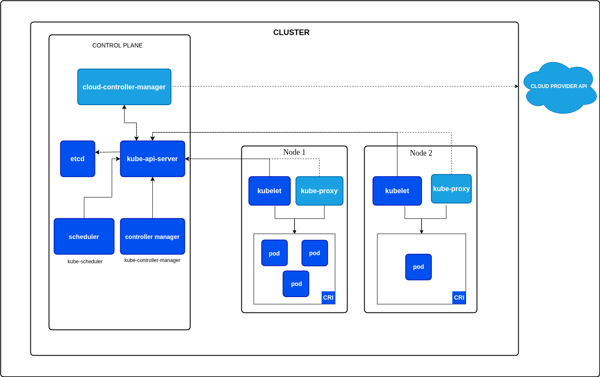

# 🚀 Day 19 — Introduction to Kubernetes & Architecture

## 📝 Topic: Why Kubernetes Exists, Docker's Limitations & The K8s Architecture Deep Dive
##  KUBERNETES : CONTAINER ORCHESTRATION ENGINE(COE)
**Instructor:** [Abhishek Veeramalla](https://github.com/iam-veeramalla)

**Date:** June 25, 2026

---

## 🎯 Learning Objectives
* Understand why Kubernetes is called "K8s".
* Identify the four critical limitations of running Docker alone in production.
* Explain how Kubernetes solves each of those limitations.
* Distinguish the Control Plane from the Data Plane (Worker Nodes).
* Know the role of every Kubernetes component: API Server, Scheduler, etcd, Controller Manager, CCM, Kubelet, Kube-proxy, and Container Runtime.
* Understand what CNCF is and why it matters for Kubernetes longevity.

---

## 🔢 Part 1 — Why is Kubernetes Called "K8s"?

```
K  u  b  e  r  n  e  t  e  s
K  [8 letters in between]   s

→ K8s
```

The name follows a common developer shorthand — taking the first letter, the count of letters in between, and the last letter. The same pattern applies to:
* `i18n` → internationalization
* `a11y` → accessibility
* `l10n` → localization

**Kubernetes** itself comes from the Greek word for **"helmsman"** or **"pilot"** — the person who steers a ship. Fitting for a tool that steers containers across infrastructure.

---

## ⚠️ Part 2 — The Four Problems with Docker Alone

Docker is excellent for building and running individual containers. It is **not enterprise-ready** on its own. These four gaps make running raw Docker in production dangerous at scale.

### Problem 1 — Single Host Dependency

```
Docker host (one machine):
  Container A → running
  Container B → running
  Container C → running
  Container D → running

Host runs out of CPU / RAM:
  New container request → FAILS — no resources
  Existing containers → may crash due to resource contention

Result: one machine going down = entire application going down
```

Docker has no built-in concept of distributing containers across multiple machines. It lives on one host. One host going down means everything it runs goes down with it.

---

### Problem 2 — No Auto-Healing

```
Docker host:
  Container A crashes at 3:42 AM
  → Container is stopped
  → Nothing happens
  → Service is down until someone manually restarts it

Engineer wakes up at 8:00 AM → sees 500 errors since 3:42 AM
→ Manual intervention required: docker restart container-a
```

Docker does not detect crashed containers and restart them automatically. You can use `--restart=always` as a workaround, but it is basic and limited — no health checks, no traffic rerouting, no replacement while the old container recovers.

---

### Problem 3 — No Auto-Scaling

```
Normal traffic:   1 container handles 100 requests/sec → fine
Traffic spike:    suddenly 10,000 requests/sec → 1 container overwhelmed

Docker solution:  engineer manually runs:
  docker run my-app
  docker run my-app
  docker run my-app
  ... (10 times)

But now:
  → Who distributes traffic across these 10 containers?
  → No built-in load balancer for the extra instances
  → When traffic drops, who removes the extra containers?
  → All of this is manual
```

Docker has no built-in mechanism to watch traffic or resource metrics and automatically scale container count up or down.

---

### Problem 4 — No Enterprise Features

Production workloads need capabilities Docker doesn't provide natively:

| Need | Docker | Reality |
|---|---|---|
| **Load balancing** across many containers | Basic `-p` port mapping only | No intelligent traffic routing |
| **Firewall / network policy** | Basic network isolation | No fine-grained policy enforcement |
| **Complex traffic routing** | Not supported | Can't route `/api` to one service and `/web` to another |
| **Rolling deployments** | Manual | No zero-downtime update mechanism |
| **Secret management** | Basic env vars | No enterprise secret store |
| **Health checks + recovery** | Limited | No self-healing loop |

---

## ✅ Part 3 — How Kubernetes Solves Each Problem

> *"Kubernetes is a Container Orchestration Platform."*

It doesn't just run containers — it manages them at scale, across multiple machines, with built-in recovery and scaling.

### Solution 1 — Cluster Architecture (vs Single Host)

```
Docker: 1 host → single point of failure

Kubernetes Cluster:
  ┌─────────────────────────────────────────────────┐
  │              Control Plane (Master)             │
  │   API Server | Scheduler | etcd | Controllers   │
  └───────────────────────┬─────────────────────────┘
                          │ manages
              ┌───────────┼───────────┐
              ▼           ▼           ▼
         Worker Node  Worker Node  Worker Node
         (Pod A, B)   (Pod C, D)   (Pod E, F)
```

Containers (called **Pods** in Kubernetes) are distributed across multiple worker nodes. If one node goes down, the control plane reschedules its pods on healthy nodes. No single point of failure.

---

### Solution 2 — Auto-Healing

```
Kubernetes cluster:
  Pod A crashes at 3:42 AM
  → Kubelet detects: "this pod is not running"
  → Reports to API Server
  → Controller Manager: "desired state = 3 replicas, current = 2"
  → Scheduler assigns new pod to a healthy node
  → New pod is running at 3:42:04 AM

Users experience: 4 seconds of reduced capacity
                  Zero intervention required
                  No engineer woken up
```

The control loop — **desired state vs actual state** — is Kubernetes' fundamental operating principle. It constantly reconciles the two.

---

### Solution 3 — Auto-Scaling

```
Horizontal Pod Autoscaler (HPA):
  Watch CPU usage of pods
  
  CPU < 30%:  scale down → 2 pods    (save cost)
  CPU 30-70%: stay at    → 3 pods    (normal)
  CPU > 70%:  scale up   → 10 pods   (handle traffic)

  All automatic. No engineer needed.
```

**ReplicaSets** ensure a specified number of pod replicas are always running. **HPA** adjusts that number dynamically based on metrics.

---

### Solution 4 — Extensibility for Enterprise Needs

Kubernetes acknowledges it can't do everything out of the box. Instead it provides **extension points**:

```
Need sophisticated load balancing?
  → Install an Ingress Controller (Nginx Ingress, Traefik, AWS ALB)

Need network policies / firewall rules?
  → Install a CNI plugin (Calico, Cilium)

Need a service mesh?
  → Install Istio or Linkerd

Need custom resources?
  → Write a CRD (Custom Resource Definition) + Controller
```

This extensibility is why Kubernetes has become a platform for building platforms — the core is minimal, and the CNCF ecosystem provides the rest.

---

## 🌐 Part 4 — CNCF: The Foundation Behind Kubernetes

**CNCF = Cloud Native Computing Foundation**

```
CNCF is a vendor-neutral foundation under the Linux Foundation
  → Hosts Kubernetes, Prometheus, Helm, Argo, Flux, containerd, and 100+ more projects
  → Backed by Google, Microsoft, Amazon, Red Hat, IBM, and hundreds of others
  → Ensures no single company can control or kill Kubernetes
  → Maintains the roadmap through community contribution
```

**Why this matters for your career:**

```
Kubernetes is not going away.
  → It's governed by a foundation, not a company
  → Even if Google walked away, the community continues
  → CNCF projects are the standard for cloud-native infrastructure

Learning Kubernetes = learning a foundational skill that transfers
across AWS (EKS), Azure (AKS), GCP (GKE), and on-premise clusters.
```

---

## 🏗️ Part 5 — Kubernetes Architecture

---

## 🧠 Part 6 — Control Plane Components (Master Node)

The control plane is the **brain** of the cluster. It makes decisions — where to run pods, how many, how to heal them. It does not run application workloads itself.

### API Server

```
Role: The single entry point for all Kubernetes operations

Every kubectl command → hits the API Server
Every internal component → talks through the API Server

kubectl apply -f deployment.yaml
  → authenticates the request
  → validates the YAML
  → stores intent in etcd
  → notifies relevant controllers
```

> **The API Server is the only component that communicates directly with etcd.** All other components go through the API Server to read or write cluster state.

---

### Scheduler

```
Role: Decides WHICH worker node a new pod runs on

When a new pod is created (no node assigned):
  Scheduler watches: "there's an unscheduled pod"
  Checks each node:
    → How much CPU is available?
    → How much memory is available?
    → Does the node match the pod's node selector?
    → Are there any taints that would reject this pod?
  Assigns the pod to the best-fit node
  API Server is notified → Kubelet on that node starts the pod
```

The Scheduler does NOT start the pod — it only decides placement.

---

### etcd

```
Role: The cluster's source of truth — a distributed key-value store

Stores:
  → All pod definitions
  → All deployment configurations
  → All service definitions
  → All node states
  → All secrets and configmaps
  → The complete desired state of the cluster

If etcd is lost → the cluster loses all state → catastrophic
If etcd is corrupted → cluster behavior becomes unpredictable
→ Always back up etcd in production
```

etcd uses the **Raft consensus algorithm** to replicate data across multiple nodes, providing high availability for the cluster state.

---

### Controller Manager

```
Role: Runs control loops that reconcile desired state with actual state

Contains many built-in controllers:
  ReplicaSet Controller:
    "Desired replicas = 3, Actual = 2 (one crashed)"
    → Creates a new pod to match desired state

  Deployment Controller:
    Manages rolling updates and rollbacks

  Node Controller:
    Watches for node failures
    Marks nodes as NotReady if they stop reporting

  Service Account Controller:
    Creates default service accounts for new namespaces
```

Every controller runs a continuous loop: **observe → compare → act**.

---

### Cloud Controller Manager (CCM)

```
Role: Bridges Kubernetes and cloud provider APIs

Only present in cloud-managed clusters (EKS, AKS, GKE)
NOT needed for on-premise bare-metal clusters

Examples:
  You create a Kubernetes Service of type LoadBalancer
  → CCM calls the AWS API: "create an ALB"
  → ALB is provisioned, IP assigned, Kubernetes Service updated

  You create a PersistentVolumeClaim
  → CCM calls the AWS API: "create an EBS volume"
  → Volume created and attached to the correct node
```

CCM decouples cloud-specific logic from the core Kubernetes codebase.

---

## ⚙️ Part 7 — Data Plane Components (Worker Node)

Worker nodes run the actual application workloads — the pods. Each worker node has three mandatory components.

### Kubelet

```
Role: The node agent — ensures pods are running as specified

Kubelet runs on every worker node
Receives pod specifications from the API Server
Reports node and pod status back to the API Server

Continuous loop:
  "API Server says Pod A should be running on this node"
  Kubelet checks: is Pod A running?
    Yes → report status "Running"
    No  → tell the container runtime to start it
          if it keeps failing → report to API Server → trigger replacement
```

The Kubelet is the primary auto-healing mechanism at the node level.

---

### Kube-proxy

```
Role: Network rules and load balancing for pods

Manages iptables rules on the node
Ensures:
  → Every pod gets an IP address
  → Services (ClusterIP, NodePort, LoadBalancer) route to correct pods
  → Traffic to a Service is load-balanced across all backing pods

Example:
  Service "my-app" → 3 pods (172.16.0.2, 172.16.0.3, 172.16.0.4)
  Request hits Service IP
  Kube-proxy iptables rule: distribute across all 3 pod IPs
```

---

### Container Runtime

```
Role: Actually starts and stops containers

Kubernetes is container-runtime-agnostic
  → Uses the CRI (Container Runtime Interface) standard

Supported runtimes:
  containerd  ← most common, default in modern Kubernetes
  CRI-O       ← lightweight, designed specifically for Kubernetes
  Docker shim ← deprecated in Kubernetes 1.24+

Docker vs containerd:
  Docker = full platform (daemon, CLI, build, registry)
  containerd = just the runtime layer
  Kubernetes only needs the runtime — not the full Docker stack
```

---

## 📊 Part 8 — Docker vs Kubernetes: Side-by-Side

| Capability | Docker | Kubernetes |
|---|---|---|
| **Run containers** | ✅ | ✅ (via container runtime) |
| **Multi-host distribution** | ❌ | ✅ Cluster architecture |
| **Auto-healing** | ❌ (basic restart only) | ✅ Controller Manager + Kubelet |
| **Auto-scaling** | ❌ Manual | ✅ HPA + ReplicaSets |
| **Load balancing** | ❌ Basic port mapping | ✅ Services + Ingress |
| **Rolling deployments** | ❌ Manual | ✅ Deployments |
| **Secret management** | ❌ Env vars only | ✅ Secrets API |
| **Network policies** | ❌ Basic | ✅ NetworkPolicy + CNI |
| **Storage orchestration** | ❌ Manual volumes | ✅ PV, PVC, StorageClass |
| **Enterprise extensibility** | ❌ | ✅ CRDs, Operators, Webhooks |

---

## 📖 Key Terms

| Term | What it means |
|---|---|
| **K8s** | Kubernetes shorthand — K + 8 letters + s |
| **Kubernetes** | Greek for "helmsman" — an open-source container orchestration platform |
| **Container Orchestration** | Automating the deployment, scaling, and management of containerized applications |
| **Pod** | The smallest deployable unit in Kubernetes — one or more containers sharing network and storage |
| **Cluster** | A set of machines (nodes) running Kubernetes — one control plane, multiple worker nodes |
| **Control Plane** | The master components that make decisions about the cluster |
| **Worker Node** | A machine that runs application pods |
| **API Server** | The gateway for all Kubernetes operations — every command goes through it |
| **Scheduler** | Decides which node a new pod runs on based on available resources |
| **etcd** | Distributed key-value store — the single source of truth for cluster state |
| **Controller Manager** | Runs control loops that keep actual state matching desired state |
| **Cloud Controller Manager** | Bridges Kubernetes with cloud provider APIs (AWS, Azure, GCP) |
| **Kubelet** | Node agent — ensures pods are running as specified, reports status to API Server |
| **Kube-proxy** | Manages network rules and load balances traffic to pods via iptables |
| **Container Runtime** | The software that actually runs containers (containerd, CRI-O) |
| **ReplicaSet** | Ensures a specified number of pod replicas are always running |
| **HPA** | Horizontal Pod Autoscaler — scales pod count based on CPU/memory metrics |
| **CRD** | Custom Resource Definition — extends the Kubernetes API with custom resource types |
| **Ingress** | Manages external HTTP/HTTPS traffic routing into the cluster |
| **CNCF** | Cloud Native Computing Foundation — the vendor-neutral foundation that governs Kubernetes |
| **CRI** | Container Runtime Interface — the standard Kubernetes uses to communicate with container runtimes |
| **Desired State** | What you declare Kubernetes should maintain (e.g. 3 replicas) |
| **Actual State** | What is currently running in the cluster |
| **Control Loop** | The continuous observe → compare → act cycle that drives Kubernetes reconciliation |

---

## 📂 Summary of Tasks
- ✅ Understood: Why Kubernetes is called K8s — naming convention, Greek origin.
- ✅ Identified: The 4 Docker limitations — single host, no auto-healing, manual scaling, no enterprise features.
- ✅ Understood: How Kubernetes solves each — cluster, auto-healing loop, HPA/ReplicaSets, CRDs.
- ✅ Understood: CNCF — vendor-neutral governance, why K8s is a career-safe investment.
- ✅ Mapped: Full cluster architecture — control plane + worker nodes with all components.
- ✅ Learned: Control Plane — API Server, Scheduler, etcd, Controller Manager, CCM.
- ✅ Learned: Worker Node — Kubelet, Kube-proxy, Container Runtime.
- ✅ Understood: The desired state vs actual state control loop — the core Kubernetes operating principle.
- ✅ Understood: Why containerd replaced Docker as the Kubernetes container runtime.

---

## 💡 My Takeaway

The **desired state vs actual state** concept is the mental model that makes Kubernetes click. You don't tell Kubernetes "start this container." You tell it "I want 3 replicas of this container running at all times." Kubernetes figures out how to make that true — and keeps making it true, continuously, even as containers crash, nodes fail, and traffic spikes. Every component in the architecture exists to serve that one loop.

The etcd backup point is also worth internalizing early. etcd is where every piece of cluster state lives. Lose etcd without a backup and the cluster doesn't know what it was supposed to be running — recovery is extremely difficult. In production, etcd backup is a day-one operational requirement, not an afterthought.

The CCM distinction was another useful framing: cloud-managed Kubernetes (EKS, AKS, GKE) includes CCM so that a `Service: LoadBalancer` automatically provisions a cloud load balancer. On-premise clusters don't have CCM — you'd need something like MetalLB to provide load balancer functionality instead.

---

## 📈 Next Up
**Day 20:** Kubernetes hands-on — setting up a local cluster with `minikube`, writing Pod and Deployment YAML manifests, and using `kubectl` to interact with the cluster.

---

## 🔗 Resources
* [Kubernetes Official Documentation](https://kubernetes.io/docs/home/)
* [CNCF Landscape](https://landscape.cncf.io/)
* [Kubernetes Components — Official Docs](https://kubernetes.io/docs/concepts/overview/components/)
* [etcd Documentation](https://etcd.io/docs/)
* [Kelsey Hightower — Kubernetes the Hard Way](https://github.com/kelseyhightower/kubernetes-the-hard-way)
* [The Illustrated Children's Guide to Kubernetes](https://www.cncf.io/phippy/the-childrens-illustrated-guide-to-kubernetes/)

---
*Follow my journey! Feel free to ⭐ this repository to stay updated.*


