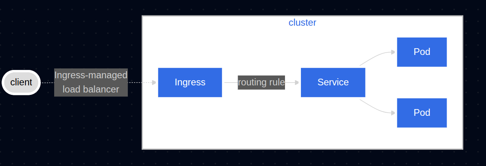
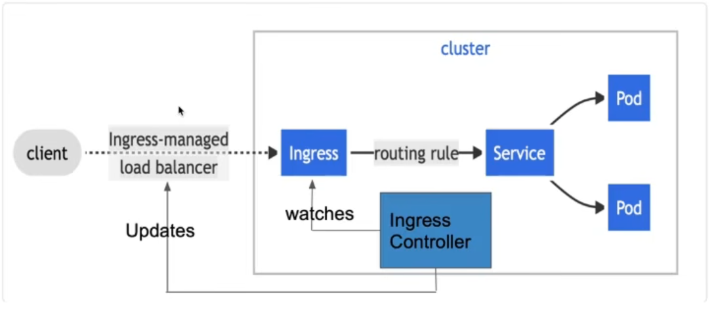
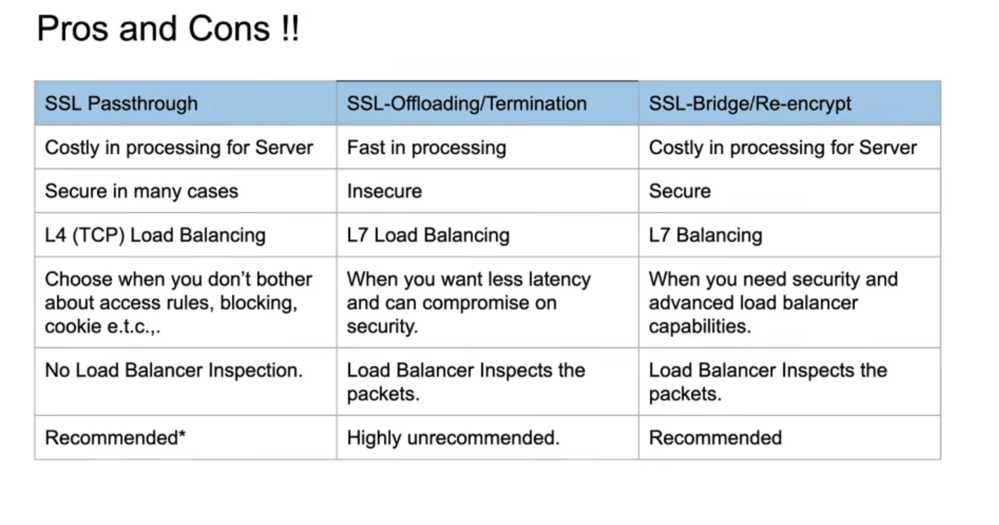

# 🚀 Day 24 — Kubernetes Ingress Deep Dive

## 📝 Topic: Why Ingress Exists, Ingress vs. Ingress Controller, Routing & TLS Strategies
**Instructor:** [Abhishek Veeramalla](https://github.com/iam-veeramalla)

**Date:** July 01, 2026

---

## 🎯 Learning Objectives
* Understand exactly what problems Ingress solves that Services alone cannot.
* Distinguish clearly between an **Ingress Resource** and an **Ingress Controller**.
* Recap Service types (ClusterIP, NodePort, LoadBalancer) as the foundation Ingress builds on.
* Practically enable and configure Ingress on Minikube.
* Implement host-based and path-based routing.
* Understand `IngressClass` and why multiple controllers can coexist in one cluster.
* Compare the three TLS strategies for securing Ingress traffic: Passthrough, Offloading, and Bridging.
* Understand how OpenShift Routes map to the same concepts under different names.

> 💡 **Instructor's note carried over from this session:** Before diving into Ingress, revisit "Deep Dive of Kubernetes Services" (Day 23/25) — Ingress is built entirely on top of the Service abstraction, and the round-robin/label-selector foundations from that session are assumed knowledge here.

---

## ❓ Part 1 — Why Ingress Is Required

### The Two Problems Services Alone Can't Solve

```
Problem 1: Limited routing intelligence
  LoadBalancer / NodePort Services only do simple round-robin balancing.
  They have NO concept of:
    - path-based routing   (/api → service A, /web → service B)
    - host-based routing   (api.foo.com → service A, app.foo.com → service B)
    - sticky sessions
    - TLS/SSL termination logic

Problem 2: Cost at scale
  Every `type: LoadBalancer` Service provisions its own cloud load balancer
  → its own static public IP
  → 50 microservices = 50 external IPs = 50 LBs = expensive, hard to manage
```

> **The fix:** Ingress lets many services sit behind **one** IP address and one entry point, with routing rules deciding where traffic goes from there.

```
Before Ingress:                       After Ingress:
  Service A → LB → IP 1                  Service A ┐
  Service B → LB → IP 2                  Service B ├─→ Ingress → Single IP
  Service C → LB → IP 3                  Service C ┘
```

---

## 🧩 Part 2 — Ingress vs. Ingress Controller

This distinction is the single most important mental model from this session:

| Concept | What it is | Analogy |
|---|---|---|
| **Ingress Resource** | A YAML file where *you* define routing rules — "if path is `/abc`, send to Service 1" | A set of instructions |
| **Ingress Controller** | The actual running software (NGINX, F5, HAProxy, etc.) that *watches* Ingress resources and *implements* them as real routing config | The worker that reads and executes those instructions |

```
kubectl apply -f ingress.yaml   (Ingress Resource created)
              ↓
Ingress Controller (e.g. NGINX) is watching the API server
              ↓
Controller detects the new/changed Ingress resource
              ↓
Controller rewrites its internal config (e.g. nginx.conf)
              ↓
Routing rules are now live
```

> **Key point:** An Ingress *resource* with no Ingress *controller* installed does nothing. The resource is just declared intent — it needs a controller to act on it.

Ingress

Ingress Controller

---

## 🔁 Part 3 — Services Recap (Foundation for Ingress)

Quick recap of the three Service types Ingress sits on top of:

```
ClusterIP
  → Accessible only inside the cluster
  → Default type, used as the backend target for Ingress rules

NodePort
  → Exposes a service on a fixed port across every node
  → Drawback: opens a wide port range on the node firewall

LoadBalancer
  → Cloud provider provisions a real external LB + public IP (e.g. AWS EKS)
  → On bare metal, projects like MetalLB can implement this behavior
  → Ingress typically sits BEHIND one single LoadBalancer Service,
    instead of one LB per microservice
```

---

## 🛠️ Part 4 — Practical Implementation (on Minikube)

### Step 1: Enable the Ingress Addon

```bash
minikube addons enable ingress
```

This installs and starts an NGINX Ingress Controller inside the cluster — without this, any Ingress resource created below is inert.

### Step 2: Define Routing Rules

```yaml
# ingress.yaml
apiVersion: networking.k8s.io/v1
kind: Ingress
metadata:
  name: my-app-ingress
  annotations:
    nginx.ingress.kubernetes.io/rewrite-target: /
spec:
  ingressClassName: nginx
  rules:
    - host: foo.bar.com
      http:
        paths:
          - path: /
            pathType: Prefix
            backend:
              service:
                name: my-app-service
                port:
                  number: 80
```

```bash
kubectl apply -f ingress.yaml

kubectl get ingress
# NAME              CLASS   HOSTS         ADDRESS        PORTS
# my-app-ingress    nginx   foo.bar.com   192.168.49.2   80
```

The controller detects this resource and updates its internal routing config automatically — no manual `kubectl edit` on the controller itself is needed.

### Step 3: Local DNS Workaround

Since `foo.bar.com` doesn't exist in public DNS, the local machine needs to be told where to send that hostname manually:

```bash
# /etc/hosts
192.168.49.2   foo.bar.com
```

```
Why this matters:
  In production, a real domain's DNS A-record points to the
  Ingress controller's IP. Locally there is no DNS provider,
  so /etc/hosts fakes that resolution for testing purposes.
```

```bash
curl http://foo.bar.com
# Routed through the Ingress Controller → my-app-service → Pod
```

---

## 🌐 Part 5 — Host-Based & Path-Based Routing

### Host-Based Routing

```yaml
rules:
  - host: food.bar.com
    http:
      paths:
        - path: /
          pathType: Prefix
          backend:
            service:
              name: food-service
              port:
                number: 80
```

```
Traffic to food.bar.com  → food-service
Traffic to other.bar.com → other-service
                (same IP, same Ingress, different backend)
```

### Path-Based Routing

```yaml
rules:
  - host: foo.bar.com
    http:
      paths:
        - path: /first
          pathType: Prefix
          backend:
            service:
              name: first-service
              port:
                number: 80
        - path: /second
          pathType: Prefix
          backend:
            service:
              name: second-service
              port:
                number: 80
```

```
foo.bar.com/first   → first-service
foo.bar.com/second  → second-service
```

### Wildcards

```yaml
rules:
  - host: "*.bar.com"
    http:
      paths:
        - path: /
          pathType: Prefix
          backend:
            service:
              name: catch-all-service
              port:
                number: 80
```

> Useful for managing many subdomains without writing a rule per subdomain.

---

## 🏷️ Part 6 — IngressClass: Multiple Controllers, One Cluster

```
Scenario: Cluster runs BOTH NGINX Ingress Controller AND HAProxy Ingress Controller

Without IngressClass:
  → Both controllers see every Ingress resource
  → Both try to implement the same rules → conflicts

With IngressClass:
  spec:
    ingressClassName: nginx    ← only the NGINX controller watches this one
```

`IngressClass` acts as a filter so each controller only reconciles the Ingress resources explicitly assigned to it — critical in clusters where multiple controllers coexist for different teams or traffic types.

---

## 🔐 Part 7 — Securing Ingress with TLS

Three distinct strategies, each with different tradeoffs:

### 1. SSL Passthrough

```
Client --[encrypted]--> Load Balancer --[still encrypted]--> Backend Pod
                                                  (decryption happens at the Pod)
```
* Traffic stays encrypted end-to-end.
* Simple, but the load balancer can't inspect traffic — meaning **no path/host-based routing** is possible, since the LB never sees the unencrypted request.

### 2. SSL Offloading

```
Client --[encrypted]--> Load Balancer --[PLAIN HTTP]--> Backend Pod
                              (decryption happens HERE)
```
* Load balancer handles all decryption.
* Reduces CPU load on application pods.
* Risk: traffic between the LB and the backend pod travels unencrypted inside the cluster network.

### 3. SSL Bridging / Re-encryption (Recommended)

```
Client --[encrypted]--> Load Balancer --[decrypt, inspect, RE-encrypt]--> Backend Pod
                                    (decrypted only briefly, in-flight)
```
* Load balancer decrypts just long enough to inspect and route the request (enabling path/host-based rules), then **re-encrypts** before forwarding to the backend.
* Best of both worlds: advanced routing + encrypted transport to the pod.
* Recommended approach for production-grade security.



### OpenShift Routes (Same Concepts, Different Names)

| OpenShift Term | Equivalent Ingress Concept |
|---|---|
| **Edge** | SSL Offloading |
| **Re-encrypt** | SSL Bridging |
| **Passthrough** | SSL Passthrough |

> **Noted drawback:** Storing TLS certificates in Kubernetes Secrets is comparatively more cumbersome with OpenShift Routes than with standard Kubernetes Ingress, which has more mature, native Secret integration for TLS.

---

## 📖 Key Terms

| Term | What it means |
|---|---|
| **Ingress Resource** | A YAML object declaring routing rules — has no effect without a controller |
| **Ingress Controller** | Software (NGINX, F5, HAProxy) that watches Ingress resources and implements the routing |
| **IngressClass** | A field that assigns an Ingress resource to a specific controller, enabling multiple controllers per cluster |
| **Path-Based Routing** | Routing traffic to different backends based on URL path (e.g. `/first` vs `/second`) |
| **Host-Based Routing** | Routing traffic to different backends based on the request's hostname (e.g. `food.bar.com` vs `other.bar.com`) |
| **Wildcard Host** | A host rule using `*` to match multiple subdomains with one rule |
| **`/etc/hosts`** | Local file used to manually map a hostname to an IP when no real DNS record exists |
| **`minikube addons enable ingress`** | Enables the built-in NGINX Ingress Controller on a Minikube cluster |
| **SSL Passthrough** | TLS strategy where the load balancer never decrypts traffic; encryption stays end-to-end |
| **SSL Offloading** | TLS strategy where the load balancer decrypts and forwards plain HTTP to the backend |
| **SSL Bridging (Re-encrypt)** | TLS strategy where the load balancer decrypts, inspects/routes, then re-encrypts before forwarding |
| **MetalLB** | A project that implements `LoadBalancer` Service behavior on bare-metal clusters (no native cloud LB) |
| **OpenShift Route** | OpenShift's equivalent of Ingress, using Edge/Re-encrypt/Passthrough terminology |

---

## 📂 Summary of Tasks
- ✅ Understood: The two core problems Ingress solves — limited routing intelligence and per-service LB cost.
- ✅ Distinguished: Ingress Resource (the rules) vs. Ingress Controller (the software that enforces them).
- ✅ Recapped: ClusterIP, NodePort, and LoadBalancer Service types as the foundation beneath Ingress.
- ✅ Enabled: The NGINX Ingress Controller on Minikube via `minikube addons enable ingress`.
- ✅ Configured: A working Ingress resource with host and path routing rules.
- ✅ Mapped: A local domain to the controller's IP via `/etc/hosts` for local testing.
- ✅ Implemented: Host-based routing, path-based routing, and wildcard host rules.
- ✅ Understood: How `IngressClass` allows multiple Ingress Controllers to coexist without conflict.
- ✅ Compared: SSL Passthrough vs. SSL Offloading vs. SSL Bridging/Re-encryption tradeoffs.
- ✅ Mapped: OpenShift Route terminology (Edge/Re-encrypt/Passthrough) to standard Ingress TLS strategies.

---

## 💡 My Takeaway

The Ingress-vs-Controller distinction is the part that finally clicked properly today: an Ingress resource by itself is just a YAML file describing intent — it does *nothing* on its own. It needs a controller like NGINX actively watching the API server, translating those rules into real config, and enforcing them. That's a subtle but important shift from Services, where the object itself (via kube-proxy and iptables) directly enacts the behavior.

The TLS section reframed something I'd been treating as one setting into three genuinely different architectural choices. Passthrough is simplest but blind — no routing intelligence possible since the LB never sees inside the request. Offloading is efficient but leaves an unencrypted hop inside the cluster. Bridging/re-encryption is clearly the production-grade answer: brief decryption for inspection and routing, then re-encrypted before it ever reaches the pod. Framing OpenShift's Edge/Re-encrypt/Passthrough as the exact same three concepts under different names made that section land faster than it would have standalone.

The cost angle also stuck with me — going from "why not just use LoadBalancer for everything" to "50 services = 50 external IPs = 50 bills" is the kind of concrete reasoning that makes Ingress feel like an obvious architectural default rather than an optional extra layer.

---

## 📈 Next Up
**Day 27:** Kubernetes ConfigMaps & Secrets — decoupling configuration and sensitive data from application images and Pod specs.

---

## 🔗 Resources
* [Kubernetes Ingress Documentation](https://kubernetes.io/docs/concepts/services-networking/ingress/)
* [Kubernetes Ingress Controllers](https://kubernetes.io/docs/concepts/services-networking/ingress-controllers/)
* [NGINX Ingress Controller](https://kubernetes.github.io/ingress-nginx/)
* [MetalLB Documentation](https://metallb.universe.tf/)
* [Minikube Ingress Addon Docs](https://minikube.sigs.k8s.io/docs/handbook/addons/ingress-dns/)
* [OpenShift Routes Documentation](https://docs.openshift.com/container-platform/latest/networking/routes/route-configuration.html)

---
*Follow my journey! Feel free to ⭐ this repository to stay updated.*