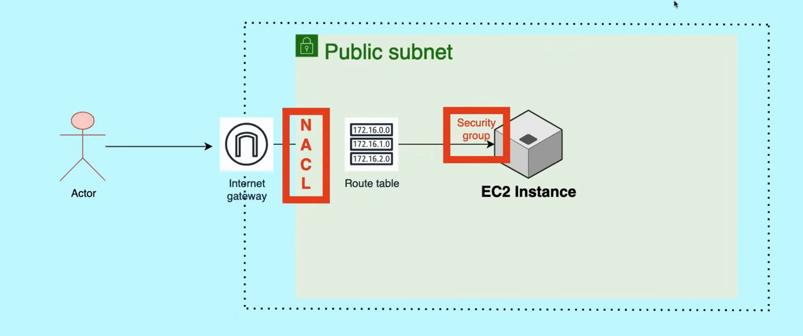

# 🚀 AWS Day 05 — Security Groups vs. Network ACLs Deep Dive

## 📝 Topic: Instance-Level vs. Subnet-Level Security, Stateful vs. Stateless Rules
**Instructor:** [Abhishek Veeramalla](https://github.com/iam-veeramalla)

**Date:** July 09, 2026
---

## 🎯 Learning Objectives
* Understand AWS's shared responsibility model for security.
* Learn Security Groups' behavior: instance-level, stateful, allow-only.
* Learn NACLs' behavior: subnet-level, stateless, allow AND deny, rule-order dependent.
* See a hands-on demonstration of both layers blocking/allowing real traffic.
* Understand how the two layers combine as complementary lines of defense.

---

## 🤝 Part 1 — The Shared Responsibility Model

```
AWS's security model splits responsibility into two halves:

  AWS's responsibility:
    → Securing the underlying infrastructure
      (physical data centers, hypervisor, network hardware)

  YOUR responsibility:
    → Configuring the specific network security rules
      that protect YOUR applications and data
      (Security Groups, NACLs, IAM policies, encryption, etc.)
```

> **Why this matters upfront:** AWS being "secure" as a platform does NOT mean an application deployed on it is automatically secure — misconfigured Security Groups or overly permissive NACLs are entirely the customer's responsibility to get right, and are one of the most common sources of real-world cloud security incidents.

---

## 🔒 Part 2 — Security Groups (Instance Level)




### Definition

```
A Security Group = a virtual firewall applied at the
                    EC2 INSTANCE level
```

### Default Behavior

```
By default:
  ALL inbound traffic  → BLOCKED
  ALL outbound traffic → ALLOWED (except port 25, blocked for anti-spam reasons)
```

### Stateful Behavior

```
Security Groups are STATEFUL:

  If an inbound request is ALLOWED in,
  the corresponding RESPONSE is automatically allowed OUT
  — regardless of what the outbound rules say.
```

```
Example:
  Inbound rule: Allow TCP port 443 from 0.0.0.0/0

  A client connects on 443 → request allowed in
  → the RETURN traffic for that same connection
    is automatically permitted out, even with
    no matching outbound rule explicitly configured for it
```

### Allow-Only Rules

```
Security Groups can ONLY contain ALLOW rules.
There is NO "deny" rule type available.

  → Anything not explicitly allowed is implicitly denied
  → But you cannot write an explicit "deny X" rule —
    only "allow Y" rules, with everything else
    defaulting to blocked
```

---

## 🧱 Part 3 — Network ACLs (Subnet Level)

### Definition

```
A Network ACL (NACL) = a security layer applied at the
                        SUBNET level
```

### Secondary Layer of Defense

```
NACLs act as a BACKUP defense layer:
  → Even if an individual instance's Security Group
    is misconfigured (too permissive), a properly
    configured NACL at the subnet level can still
    block unwanted traffic before it ever reaches the instance
```

### Stateless Behavior

```
NACLs are STATELESS:

  Return traffic is NOT automatically allowed —
  it must be EXPLICITLY permitted via a SEPARATE
  inbound or outbound rule.
```

```
Example:
  Inbound rule: Allow TCP port 443 from 0.0.0.0/0
  (but NO corresponding outbound rule for the ephemeral
   return ports)

  → The initial request comes in fine
  → But the RESPONSE going back out gets blocked
    unless an outbound rule explicitly permits it
```

### Allow AND Deny Rules

```
NACLs support BOTH:
  ALLOW rules  → explicitly permit specified traffic
  DENY rules   → explicitly block specified traffic

  (Unlike Security Groups, which only support "allow")
```

### Rule Evaluation Order

```
NACL rules are evaluated in NUMERICAL ORDER, ascending —
lowest rule number is evaluated FIRST.

  Rule #100: Allow port 8000 from 0.0.0.0/0
  Rule #200: Deny  port 8000 from 0.0.0.0/0

  → Rule #100 matches FIRST → traffic is ALLOWED
  → Rule #200 is never even evaluated for this traffic,
    because #100 already made the decision
```

> **Critical practical implication:** in NACLs, rule NUMBER ORDER determines outcome, not just the presence of an allow/deny rule. A deny rule placed AFTER a matching allow rule has zero effect — the lower-numbered rule always wins for matching traffic.

---

## 📊 Part 4 — Side-by-Side Comparison

| Aspect | Security Group | Network ACL |
|---|---|---|
| **Applies at** | Instance (EC2) level | Subnet level |
| **State** | Stateful (return traffic auto-allowed) | Stateless (return traffic needs explicit rule) |
| **Rule types** | Allow only | Allow AND Deny |
| **Evaluation** | All matching rules considered together | Numerical order, ascending — lowest number wins first match |
| **Default** | All inbound blocked, all outbound allowed | Varies by NACL — default NACL allows all, custom NACLs default to deny all |

---

## 🛠️ Part 5 — Practical Demonstration

### Setup

```
Custom VPC created with:
  → A public subnet
  → An EC2 instance running a simple Python HTTP server
    on port 8000
```

```bash
# On the EC2 instance
python3 -m http.server 8000
```

### Testing Security Groups

```
Initial state: instance is INACCESSIBLE on port 8000
  → Default Security Group blocks all inbound traffic

Fix: Update the Security Group
  → Add inbound rule: Allow TCP 8000 from 0.0.0.0/0 (or "My IP")

Result: http://<instance-public-ip>:8000 now loads successfully
```

### Testing NACLs

```
With the Security Group now correctly allowing port 8000:

  Add a NACL DENY rule for port 8000 at the SUBNET level

Result: The instance becomes INACCESSIBLE again on port 8000
  — even though the Security Group still explicitly allows it

  → Demonstrates NACLs as a genuine independent layer:
    a permissive Security Group does NOT override
    a restrictive NACL
```

### Demonstrating Rule Order

```
Two NACL rules configured for the same port:
  Rule #100: Deny  port 8000
  Rule #90:  Allow port 8000

  → Rule #90 evaluated FIRST (lower number)
  → Traffic is ALLOWED — the Deny at #100 never gets evaluated
    for this traffic, since #90 already resolved it

Reordering matters:
  Swap so Deny becomes the LOWER number → traffic is now blocked
```

> **The practical lesson from this demo:** debugging "why is my NACL rule not working" almost always comes down to checking whether a LOWER-numbered rule is already matching and deciding the outcome before the intended rule is even reached.

---

## 📖 Key Terms

| Term | What it means |
|---|---|
| **Shared Responsibility Model** | AWS secures the infrastructure; the customer is responsible for configuring application-level network security |
| **Security Group** | Instance-level, stateful virtual firewall supporting allow-only rules |
| **Network ACL (NACL)** | Subnet-level, stateless firewall supporting both allow and deny rules |
| **Stateful** | Return traffic for an allowed request is automatically permitted, without a separate matching rule |
| **Stateless** | Return traffic requires its own explicit rule — nothing is automatically inferred |
| **Rule Evaluation Order (NACL)** | Rules processed in ascending numerical order; the first matching rule decides the outcome |
| **Port 8000** | The port used in this session's Python HTTP server demonstration |
| **Ephemeral Ports** | Temporary, dynamically assigned ports used for return traffic — a common source of stateless-NACL misconfiguration |

---

## 📂 Summary of Tasks
- ✅ Understood: AWS's shared responsibility model — infrastructure security (AWS) vs. application-level network security (you).
- ✅ Learned: Security Groups are instance-level, stateful, and support allow-only rules.
- ✅ Learned: NACLs are subnet-level, stateless, and support both allow and deny rules.
- ✅ Understood: NACL rules are evaluated in ascending numerical order — lowest number wins first match.
- ✅ Set up: A custom VPC with a public subnet and an EC2 instance running a Python HTTP server on port 8000.
- ✅ Demonstrated: Security Group blocking/allowing access to port 8000.
- ✅ Demonstrated: A NACL deny rule blocking traffic even with a permissive Security Group in place.
- ✅ Demonstrated: Rule number ordering directly determining which NACL rule actually takes effect.

---

## 💡 My Takeaway

The stateful-vs-stateless distinction is the one I most needed a concrete demo for — "Security Groups remember the conversation, NACLs don't" is a clean enough summary, but seeing it actually break (return traffic silently failing on a NACL without an explicit outbound rule) makes it click in a way the definition alone doesn't. This is exactly the kind of gap that would show up as "my server responds but the client says connection timed out" in real debugging, and now I know to check for a missing NACL outbound rule specifically when symptoms look like that.

The rule-ordering demonstration was the other genuinely important piece — a Deny rule sitting at a higher number than a matching Allow rule is completely inert, and that's not obvious just from reading a NACL's rule list top to bottom if you're not specifically checking the numbers in ascending order. I want to treat "check the NUMBER, not just presence" as a standing habit whenever I'm troubleshooting a NACL that "should" be blocking something but isn't.

The instance-level vs. subnet-level framing also reinforces the layered-defense pattern I keep running into across this whole learning path — Kubernetes RBAC + Namespace isolation, AWS IAM + VPC isolation, and now Security Groups + NACLs. Same underlying principle everywhere: never rely on a single layer of defense, because a single misconfiguration at that layer becomes a total failure instead of a contained one.

---


## 🔗 Resources
* [AWS Shared Responsibility Model](https://aws.amazon.com/compliance/shared-responsibility-model/)
* [Security Groups Documentation](https://docs.aws.amazon.com/vpc/latest/userguide/vpc-security-groups.html)
* [Network ACLs Documentation](https://docs.aws.amazon.com/vpc/latest/userguide/vpc-network-acls.html)
* [Comparing Security Groups and NACLs (AWS Docs)](https://docs.aws.amazon.com/vpc/latest/userguide/infrastructure-security.html)

---
*Follow my journey! Feel free to ⭐ this repository to stay updated.*